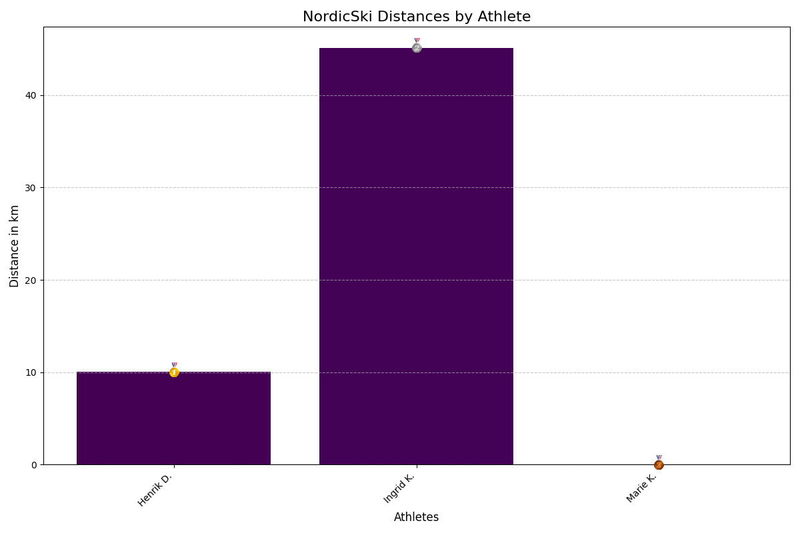

# SkiFamily-StravaScript

## Om Skriptet 💡

Dette skriptet organiserer hvem som virkelig er familiens vinner i årets skisesong. Vi trekker inn data fra Strava, lager et bar chart over distanser, og gir deg en visuell oppdatering hver time. Hvem leder an i distansekonkurransen? Sjekk diagrammet ovenfor for å finne ut!

### Hvordan Det Fungerer 🤯

- **Datafangst**: Skriptet henter data fra Strava-klubben din.
- **Analyse**: Dataene blir analysert og distanser blir plottet i et bar chart.
- **Oppdatering**: Diagrammet oppdateres automatisk hver time.

---

Med Team Kolderup Elite er det alltid en ny topp å bestige, en ny distanse å slå, og en utsikt som venter på å bli beundret. Så spenn på deg skiene, snør på deg løpeskoene, eller ta på deg fjellstøvlene – konkurransen er i gang! 🚀
